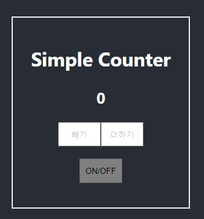
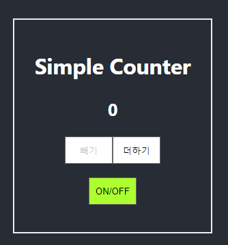
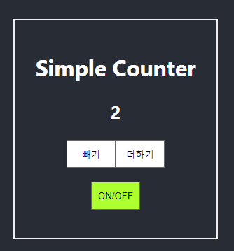

# learn-testing

## 유닛 테스트 익히기

## Refs.

- [[번역] 리액트 테스팅 튜토리얼: 테스트 프레임워크와 컴포넌트 테스트 방법](https://rinae.dev/posts/react-testing-tutorial-kr)
- [How to Advanced Webpack 5 - Setup Tutorial](https://www.robinwieruch.de/webpack-advanced-setup-tutorial)
- [How to React with Webpack 5 - Setup Tutorial](https://www.robinwieruch.de/minimal-react-webpack-babel-setup)

## SceenShot 📸

